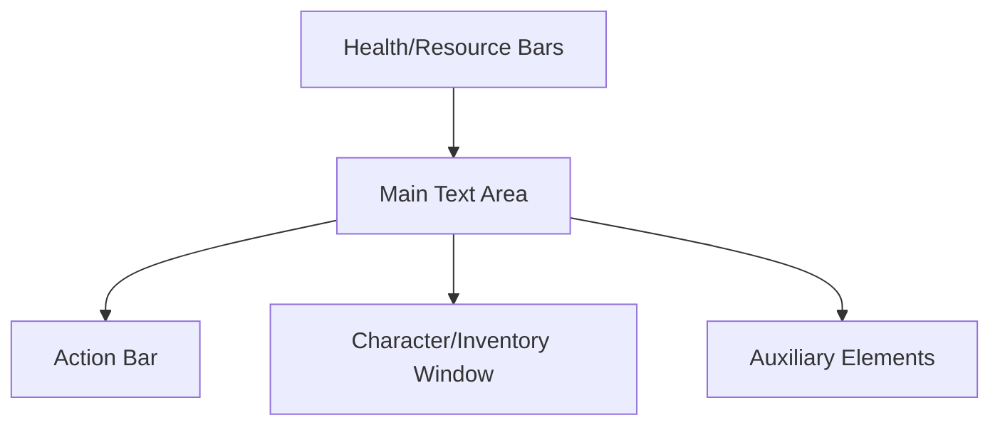

# Main Game Interface UI/UX Design Document  
*For Semi Text-Based RPG (Godot Implementation)*

---

## 1. Overview

This document defines the layout, structure, and interaction model for the main game interface, synthesizing the project vision and gameplay loop with direct references to the provided mockups:  
- [Character Window](CharacterWindow.png)  
- [Equip/Actionbar/Bag](Equip-Actionbar-Bag.png)  

The design ensures a seamless blend of text-based narrative and interactive GUI elements, supporting extensibility and modularity in Godot.

---

## 2. Main UI Layout & Structure

### 2.1. High-Level Layout

The main interface is divided into the following primary regions:

- **Main Text Area**: Central, large area for narrative, dialogue, and event descriptions.
- **Action Bar**: Horizontal bar (bottom center) for quick actions, skills, and item use.
- **Character/Inventory Window**: Side panel (toggleable) for character stats, equipment, and inventory.
- **Health/Resource Bars**: Prominently displayed, typically above or near the main text area.
- **Auxiliary Elements**: Mini-map, notifications, quest tracker, etc. (optional/expandable).

#### Mermaid Diagram: UI Layout

---

### 2.2. Mockup Analysis & Visual Details

#### 2.2.1. [CharacterWindow.png](CharacterWindow.png:1)

- **Character Portrait**: Top-left, circular or rounded rectangle frame.
- **Name & Level**: Next to portrait, bold and prominent.
- **Stat Block**: Grid/table layout, showing core stats (HP, MP, STR, DEX, etc.) with icons and values.
- **Equipment Slots**: Visual slots (head, chest, legs, etc.) with item icons; empty slots are grayed out.
- **Inventory Grid**: Below or beside equipment, grid of item icons with tooltips on hover.
- **Buttons**: "Equip", "Unequip", "Close" – clear, visually distinct.

#### 2.2.2. [Equip-Actionbar-Bag.png](Equip-Actionbar-Bag.png:1)

- **Action Bar**: Bottom center, horizontal row of large, clickable icons (skills, items, etc.), with keybind indicators.
- **Bag/Inventory Button**: Near action bar, toggles inventory window.
- **Quick Stats**: Small, always-visible HP/MP bars near action bar.
- **Tooltip Popups**: On hover, show item/skill details in a styled popup.
- **Drag-and-Drop**: Items/skills can be dragged between action bar, inventory, and equipment slots.

---

## 3. Integration of Text-Based and GUI Elements

- **Narrative Flow**: Main text area updates with story, choices, and combat logs. Choices appear as clickable buttons or links below the text.
- **GUI Overlays**: Action bar, inventory, and character windows overlay the text area but do not obscure critical information.
- **Contextual Actions**: When a choice or event is available, relevant action bar buttons highlight or animate.
- **Feedback**: Visual (flashing, color change) and audio cues for important events (damage, loot, level up).

---

## 4. Visual Hierarchy & User Flow

### 4.1. Visual Hierarchy

1. **Main Text Area**: Largest, most central, draws user focus.
2. **Action Bar**: High-contrast icons, always visible.
3. **Health/Resource Bars**: Prominent, color-coded (red for HP, blue for MP, etc.).
4. **Character/Inventory Window**: Secondary, toggled as needed.
5. **Auxiliary Elements**: Subtle, non-intrusive.

### 4.2. User Flow

- **Default State**: Player reads narrative, sees current stats and action bar.
- **Interaction**: Player clicks a choice or uses an action bar skill.
- **Result**: Main text area updates, stats/HP bars animate if changed, inventory/equipment updates if relevant.
- **Exploration**: Player toggles character/inventory window to manage gear or view stats.
- **Combat/Events**: Action bar and main text area become primary focus; tooltips and feedback guide player actions.

---

## 5. Extensibility & Modularity in Godot

### 5.1. Scene Structure

- **MainGameUI (Root Scene)**
  - MainTextArea (Control/Panel)
  - ActionBar (Control/HBoxContainer)
  - HealthResourceBars (Control/HBoxContainer)
  - CharacterWindow (separate scene, instanced as needed)
  - InventoryWindow (separate scene, instanced as needed)
  - TooltipPopup (singleton or autoload)
  - AuxiliaryElements (optional scenes: MiniMap, QuestTracker, etc.)

### 5.2. Reusable Components

- **ActionButton**: For action bar, inventory, and equipment slots (supports drag-and-drop, tooltips).
- **StatBar**: For HP/MP/XP, customizable color/label.
- **ItemSlot**: For inventory/equipment, supports drag-and-drop and tooltips.
- **PopupWindow**: For tooltips, notifications, and modal dialogs.

### 5.3. Modularity Recommendations

- Use Godot’s scene instancing for windows/panels (Character, Inventory, etc.).
- Use signals for UI-to-game logic communication (e.g., action bar button pressed).
- Keep UI logic separate from game logic (MVC or MVVM pattern).
- Design UI components to be themeable and reskinnable for future updates.

---

## 6. Actionable Implementation Notes

- **Start with wireframes** based on the mockups, then build each UI region as a Godot scene.
- **Implement drag-and-drop** using Godot’s built-in UI drag-and-drop system for inventory/equipment/action bar.
- **Use tooltips** for all interactive elements, styled to match the game’s theme.
- **Support keyboard navigation** for accessibility (tab through buttons, use keybinds for action bar).
- **Test overlay behavior** to ensure windows/panels do not obscure critical narrative text.

---

## 7. References

- [CharacterWindow.png](CharacterWindow.png:1): Reference for character/inventory layout, stat display, and equipment slots.
- [Equip-Actionbar-Bag.png](Equip-Actionbar-Bag.png:1): Reference for action bar, quick stats, inventory toggle, and drag-and-drop.

---

## 8. Appendix: Example UI State

- **Exploration**: Main text area shows story, action bar has “Look”, “Talk”, “Inventory”, “Map”.
- **Combat**: Main text area shows combat log, action bar has “Attack”, “Skill 1”, “Skill 2”, “Item”, “Flee”.
- **Inventory Open**: Inventory window overlays right side, drag items to action bar or equipment slots.

---

This document provides a comprehensive, actionable foundation for implementing the main game interface in Godot, ensuring a seamless blend of text-based and GUI-driven gameplay.