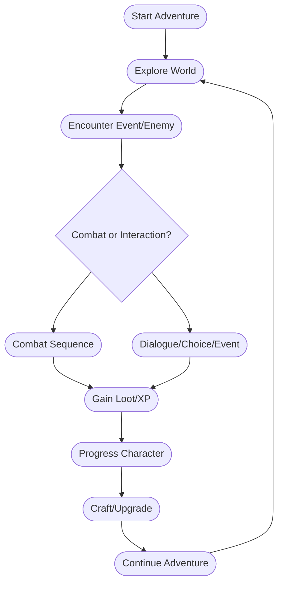
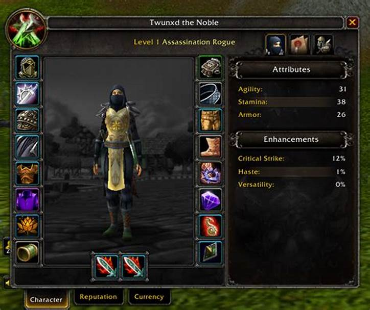
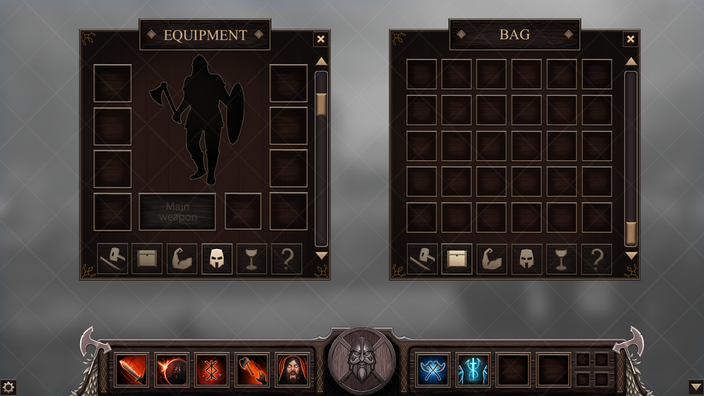

# Semi Text-Based RPG Design Document  
*High Fantasy with Magic and Steampunk Elements*

---

## 1. Game Overview and Vision

**Title:** (To be determined)  
**Genre:** Semi text-based RPG with GUI overlays  
**Setting:**  
A high fantasy world where ancient magic and steampunk technology coexist. Expect airships, clockwork automatons, arcane machinery, and enchanted landscapes.  
**Vision:**  
- Immerse players in a rich, text-driven world with the depth and systems of a classic fantasy MMORPG.
- Blend narrative exploration with tactical combat, character progression, and a visually enhanced interface.
- Emphasize player agency, discovery, and meaningful choices.

---

## 2. Core Gameplay Loop

- **Explore:** Navigate the world via text-based descriptions and choices.
- **Encounter:** Face enemies, NPCs, and environmental events.
- **Act:** Use skills, items, or actions via GUI action bars and menus.
- **Progress:** Gain experience, loot, and resources; improve character.
- **Craft/Upgrade:** Use resources to craft or enhance equipment and learn new skills.
- **Repeat:** Continue exploring, facing greater challenges and uncovering the world’s mysteries.

---

## 3. User Interface

### Text Elements
- **Main Narrative Window:** Displays world descriptions, events, and dialogue.
- **Choice Prompts:** Present player with options (e.g., “Attack”, “Negotiate”, “Flee”).
- **Combat Log:** Shows turn-by-turn actions and results.

### GUI Elements
- **Action Bar:** Clickable icons for skills, spells, and items.
- **Character Menu:** Visual window for stats, equipment, and talents.  
  
- **Inventory:** Grid or list of items, with drag-and-drop or click-to-use.  
  
- **Health/Mana Bars:** Visual representation of player and enemy status.
- **Pop-up Windows:** For crafting, equipment management, and skill learning.

### Interaction
- Text and GUI are tightly integrated: choices in text can trigger GUI actions, and GUI actions (e.g., using a skill) update the text log and narrative.

---

## 4. Player Progression

### Stats & Leveling
- **Stats:**  
  - STAM (Stamina): +10 HP per point  
  - STR (Strength): +1 Melee Damage per point  
  - AGI (Agility): +1 Ranged Damage, +1% Dodge per point  
  - INT (Intellect): +1 Magic Damage, +10 MP per point  
  - Armor: +1 Damage Reduction per point  
  - Resistance: +1 Magic Damage Reduction per point  
- **Leveling:**  
  - Gain XP from combat, quests, and exploration.
  - Each level: +5 stat points (player choice), +1 talent point (any tree).

### Skills & Abilities
- **Class-based Abilities:**  
  - Each class (e.g., Warrior, Mage, Engineer) has unique skills (see `Story/Abilities.md`).
  - Skills have types (offensive, defensive, healing), costs, and effects.
- **Skill Acquisition:**  
  - Skills are learned via leveling, quests, or trainers.

### Equipment
- **Types:** Weapons, armor, accessories, gadgets (steampunk tech).
- **Acquisition:** Loot, purchase, crafting, or quest rewards.
- **Upgrading:** Enhance or modify equipment with magical or mechanical components.

### Crafting & Learning
- **Crafting:**  
  - Gather resources from the world and enemies.
  - Use recipes/blueprints to create or upgrade items.
- **Learning:**  
  - Discover blueprints, magical tomes, or schematics for new skills/equipment.

### Talents
- **Talent Trees:**  
  - Branching paths for specialization (see `Story/Talents.md`), e.g., Weapon Mastery, Arcane Engineering.
  - Talents can unlock new abilities, passives, or stat bonuses.

---

## 5. Enemy and Boss Encounters

### Enemy Design
- **Stat-based:**  
  - Enemies use the same stat system as players (see `Story/Enemys.md`).
- **Variety:**  
  - Goblins, orcs, trolls, clockwork automatons, magical constructs, etc.
- **Equipment:**  
  - Enemies can wield weapons, armor, and unique gadgets.

### Bosses
- **Unique Mechanics:**  
  - Multi-phase fights, environmental hazards, puzzle elements.
- **Rewards:**  
  - Rare loot, story progression, and new abilities.

### Encounter Flow
- Text describes the enemy and environment.
- GUI displays enemy stats, health bars, and action icons.
- Player chooses actions via text or GUI; results are shown in the combat log.

---

## 6. Adapting MMORPG Elements to Text-Based Format

- **Exploration:**  
  - Text-driven world navigation with branching choices and hidden secrets.
- **Combat:**  
  - Turn-based, with tactical depth via skills, items, and positioning (described in text, executed via GUI).
- **Progression:**  
  - Deep stat, skill, and talent systems; visible in both text and GUI.
- **Social/Multiplayer (optional):**  
  - Asynchronous events, leaderboards, or co-op encounters (if desired).

---

## 7. Unique Mechanics/Features

- **Hybrid UI:**  
  - Seamless blend of text adventure and modern GUI for accessibility and immersion.
- **Steampunk Magic:**  
  - Unique equipment and skills combining arcane and mechanical effects (e.g., steam-powered wands, clockwork familiars).
- **Dynamic Events:**  
  - Randomized encounters, world events, and branching storylines.
- **Crafting Depth:**  
  - Modular crafting system for both magical and mechanical upgrades.
- **Replayability:**  
  - Multiple classes, branching talent trees, and world states.

---

*End of Design Document*